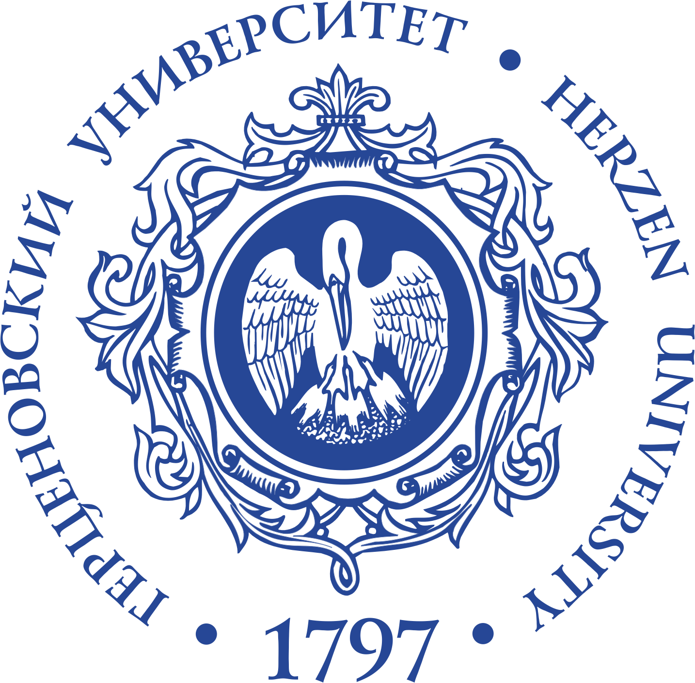

# **Корпоративное обучение разработчиков игр использованию нейросетей**

**Автор:** Кузнецовв Марк Сергеевич, студент 2-го курса КЭО  
📧 indeecdedushka@mail.ru

---

## **1. Актуальность**

- Глобальный рынок игр превысит $200 млрд к 2025 г.
- Использование нейросетей (ИИ) в игровой индустрии:
  - Генерация текстов, артов, звуков
  - Интеллектуальное поведение NPC
  - Оптимизация тестирования и аналитики
- Разработчики нуждаются в переобучении: технологии опережают кадровые компетенции

📊 *Визуализация*: рост ИИ-инструментов в игровой индустрии  
📎 *Пример инструмента*: [ChatGPT](https://openai.com/chatgpt), [Stable Diffusion](https://stability.ai/)

---

## **2. Цель исследования**

> Разработать и апробировать программу корпоративного обучения разработчиков применению нейросетей в игровой индустрии

---

## **3. Задачи**

1. Изучить текущие компетенции сотрудников
2. Проанализировать востребованные ИИ-инструменты в индустрии
3. Разработать модульную обучающую программу
4. Провести пилотное внедрение
5. Оценить эффективность по результатам тестирования и обратной связи

🗂️ *Инструменты анализа*: опросы, контент-анализ, тесты  
📌 *ИИ-инструменты*: ChatGPT, Stable Diffusion, Unity ML-Agents, GitHub Copilot

---

## **4. Методы исследования**

- 📋 Анкетирование 50 специалистов игровых компаний
- 🔍 Контент-анализ 100+ вакансий на должности гейм-дизайнеров и разработчиков
- 🧪 Сравнительный анализ уровня знаний (до и после курса)

---

## **5. Результаты**

📚 **Обучающая программа (4 недели)**:
- Модуль 1: Введение в ИИ и машинное обучение
- Модуль 2: Генеративные нейросети (текст/изображение)
- Модуль 3: Интеграция ИИ в игровые проекты (Unity/Unreal)
- Модуль 4: Этические и правовые аспекты

📈 **Эффект**:
- +35% прирост уровня знаний (по тестированию)
- 92% положительных отзывов участников
- Рост числа ИИ-функций в командных проектах на этапе внедрения

🧮 *Диаграммы*:
- Уровень знаний до/после  
- Круговая диаграмма: структура отзывов

---

## **6. Выводы**

- Корпоративное обучение с фокусом на нейросети эффективно повышает квалификацию разработчиков
- Разработанная программа показала результативность и может быть масштабирована
- Рекомендуется включение подобных курсов в HR-стратегии технологических компаний

---

## **Литература**

1. Документация: OpenAI, GitHub Copilot, Unity ML-Agents
2. Статьи и вакансии на LinkedIn, Gamasutra, Habrahabr

---
